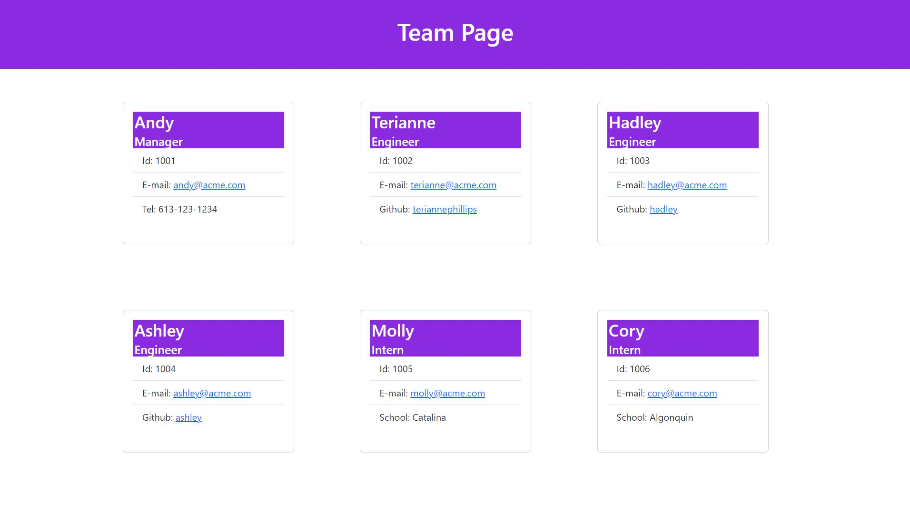

# Team Profile Generator

---
## Table of Contents
* [Description](#description)
* [Installation](#installation)
* [Usage](#usage)
* [Contributing](#contributing)
* [Tests](#tests)
* [Licence](#licence)
* [Questions](#questions)

---
## Description
This application generates a simple HTML page that displays information about a software development team. The user can add information about each team member, including their name, role, ID number, email address, and depending on their role either an office number, a github username or their current school. The application is built using Node.js and makes use of the Inquirer package to prompt the user for information. 

[BACK TO TOP](#top)

---
## Installation
To use this code to generate your own team profile, **git clone** the repo so you have a local copy on your machine. Run **npm i inquirer@8.2.4** to install the inquirer npm package dependencies.

[BACK TO TOP](#top)

---
## Usage
[View  my walk through video](https://youtu.be/z9VZSbeDK5k) 
In the command line enter **node index.js** to start the application. Answer the prompts in your command line to generate the Team Profile index.html file. After answering all the prompts, your HTML file will be named 'index.html' and will be ready for you in the /dist folder. 
 
**Sample Team Profile** 

[BACK TO TOP](#top)

---
## Contributing
We welcome and encourage contributions from the community. If you are interested in contributing to this project, you can help by contributing code by forking the repository, making your changes, and submitting a pull request. Thank you for considering a contribution to this project!

[BACK TO TOP](#top)

---
## Tests
Run npm test to run Jest for tests on the classes.

[BACK TO TOP](#top)

---
## Licence
This project is licenced by MIT License

[BACK TO TOP](#top)

---
## Questions
Please visit my [GitHub Profile](https://github.com/teriannephillips)

[E-mail me](mailto:phillips.terianne@gmail.com) if you have any further questions!

[BACK TO TOP](#top)